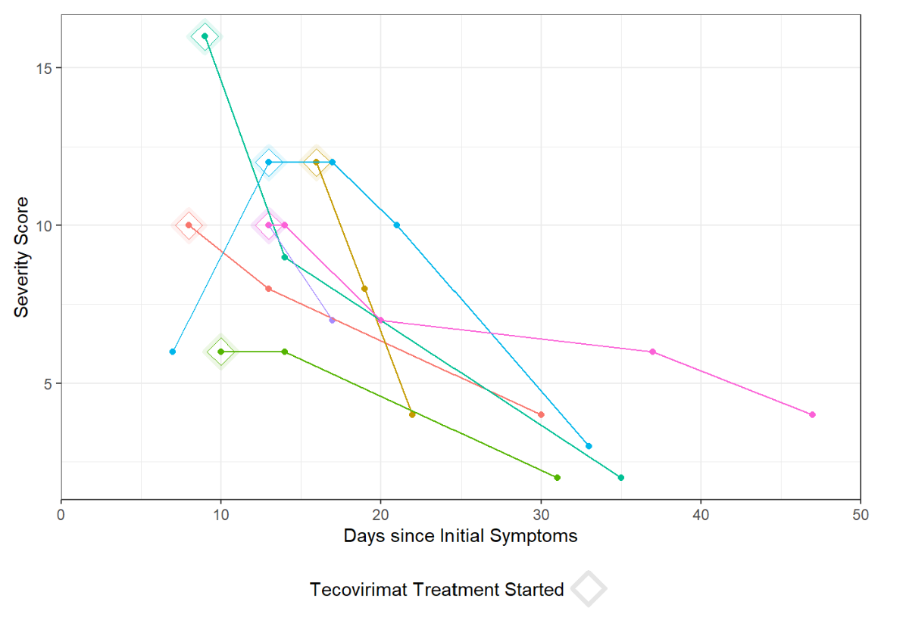

**Poster #738, Presented at CROI 2023, Feb 22, 2023**
 

**BACKGROUND**

Clinical severity scores facilitate standardized quantitative comparison of disease severity between groups of patients to understand risk factors for severe illness and evaluate treatment efficacy. Relevant severity scoring tools provide reliable discrimination across the spectrum of illness severity and are parsimonious, easy to use, and universally applicable. Prior mpox severity scores, based on numbers of skin lesions and individual functional capacity, have been less applicable to the 2022 outbreak.

 

**METHODS**

Using expert opinion and literature review, we developed an MPOX-SSS with an initial set of possible variables that we refined based on data availability, prior association with severity, and parameter correlation to include 7 final elements: number of active lesions, anatomic extent of lesion involvement, presence of confluent lesions, presence of bacterial superinfection, extent of mucosal areas affected, level of care, and analgesia requirement (tool available at mpoxseverityscore.com). We piloted this MPOX-SSS via a retrospective chart review at a single academic urban medical center and compared scores using the Wilcoxon rank sum test.

 

**CORRELATION MATRIX**

Correlation Matrix by Color Shades     |  Correlation Matrix by Coefficients
:-------------------------:|:-------------------------:
  |  

 

**RESULTS**

Among the first 200 patients presenting with mpox (median age 34, 99% born male, 38% Hispanic, 28% Black, 49% with HIV [10% CD4 count <200 cells/mm3 or VL>1000 copies/mL], 57% treated with tecovirimat), an MPOX-SSS score could be calculated for 86%; missing data that precluded scoring included lesion number (13%) and presence of confluent lesions (7%). Median scores were similar in patients with and without HIV (8 vs 9, p=0.12). Scores were higher in patients treated with tecovirimat (10 vs 4, p<0.001), patients with CD4 counts <200 cells/mm3 (10 vs 8, p=0.073), and patients presenting >3 days after symptom onset (9 vs 6, p=0.007). For a subset of individuals with multiple visits for mpox, changes in MPOX-SSS scores were detected and concordant with clinical experience.

**FIGURES**

Monkeypox Severity Score Distribution by HIV Status   |  Monkeypox Severity Score Distribution by HIV Status and CD4 Counts
:-------------------------:|:-------------------------:
  |  

**Monkeypox Severity Score Distribution by Treatment**

**Monkeypox Severity Score Overtime**

 

**CONCLUSIONS**

Our pilot MPOX-SSS was able to produce a severity score retrospectively from 86% of charts, demonstrated good discrimination with statistically higher scores in groups expected to have more severe disease, and was able to distinguish change over time for individual patients that correlated with clinical illness. We propose this tool be assessed for utility in clinical trials of mpox treatment, in prospective observational cohort studies, and in comparisons of illness caused by different mpox clades.

