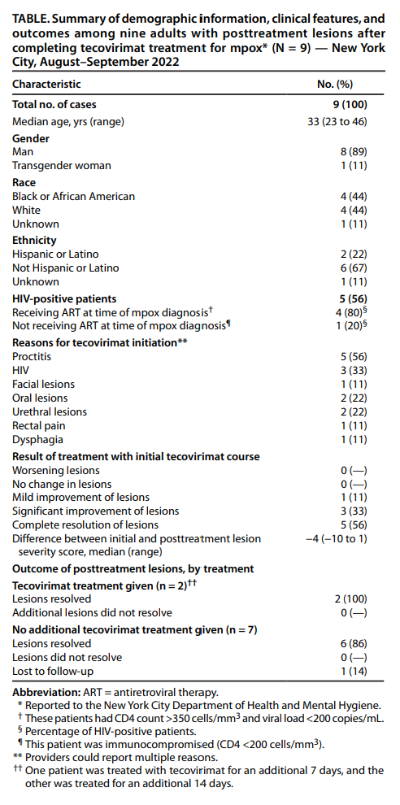

**Content**

Monkeypox virus is an orthopoxvirus that can cause substantial morbidity due to skin and mucosal lesions (1). During the 2022 multinational Monkeypox (mpox) outbreak, tecovirimat, an antiviral medication approved for the treatment of smallpox, was used as an investigational treatment for severe mpox. However, efficacy and optimal treatment duration are still being investigated (1,2). In a late 2022 assessment of the use of tecovirimat for treatment of mpox under the expanded access Investigational New Drug protocol, three patients were found to have developed new lesions after completing treatment (3). This report describes a series of patients in New York City (NYC) with mpox who also developed new lesions after completing tecovirimat treatment, suggesting that posttreatment lesions might occur more commonly than previously reported.

A case of posttreatment mpox lesions was defined as the occurrence of new skin or mucosal lesions in an NYC resident with probable or confirmed mpox (4), emerging ≤30 days after completing the recommended 14-day tecovirimat treatment course, after improvement or resolution of initial mpox lesions. During August–September 2022, health care providers voluntarily reported 10 such cases to the NYC Department of Health and Mental Hygiene (DOHMH). Providers were asked to complete a survey detailing patient demographic and clinical characteristics and illness course. Descriptive analyses were performed on the nine surveys submitted.

The median patient age was 33 years (range = 23–46 years); eight were men, and one was a transgender woman (Table). Among eight patients with race reported, four were Black or African American, and four were White. Two patients reported Hispanic or Latino ethnicity. HIV status was known for all nine patients. Five had HIV, including four who were taking antiretrovirals at the time of mpox diagnosis (CD4 count >350 cells/mm3 and viral load <200 copies/mL), and one who was not taking antiretrovirals (CD4 count <200 cells/mm3 and viral load unknown).

No patient received JYNNEOS vaccine* before experiencing mpox. Initial lesions tested positive for Orthopoxvirus using polymerase chain reaction testing. The median initial symptom severity score was 8 out of a possible 23 points (range = 6–13), assessed using the mpox severity score†. Six patients were tested for sexually transmitted infections (STIs) at the time of mpox diagnosis; one received a positive gonorrhea test result and was treated.§

The median interval from mpox symptom onset to tecovirimat initiation was 9 days (range = 6–16 days). All patients received outpatient treatment from their health care provider with weight-appropriate oral dosing of tecovirimat, and all completed the recommended 14-day course with self-reported full adherence. No patient reported an adverse reaction, and providers assessed all patients’ mpox lesions as improved after treatment completion.

New lesions appeared a median of 13 days after completion of tecovirimat treatment (range = 2–30 days). In eight patients, posttreatment lesions were rated by the provider to be less severe than initial lesions (median severity score = 3 [range = 3–7]). Among six patients for whom orthopoxvirus testing of posttreatment lesions was conducted, one received a positive result. Two patients received repeat STI testing; one received a positive syphilis test result. The immunocompromised patient with untreated HIV received both the positive posttreatment orthopoxvirus and the positive syphilis test results. Tecovirimat was restarted for two patients (one treated for 7 additional days and one treated for 14 additional days), both of whom had resolution of their lesions. Among the seven patients who did not receive a second course of tecovirimat, six had resolution of lesions, and one was lost to follow-up.

The findings in this report are subject to at least three limitations. First, because active surveillance for posttreatment lesions was not conducted, the number of cases reported here likely represents an underestimate of the actual prevalence. Second, not all posttreatment lesions were tested for Orthopoxvirus or other potential etiologies. Finally, analyses relied on provider-reported data, which can be subjective.

Further research is needed to understand the etiology of new lesions in patients with mpox after completion of tecovirimat therapy. One possibility is that Monkeypox virus, like other viruses (e.g., SARS-CoV-2), can recur (5), but the recurrent viral load might be too low for test detection. Immunocompetent patients might not require additional tecovirimat, because most posttreatment lesions in this analysis resolved without further treatment. However, the clinical course in immunocompromised patients might be more complicated. The proportions of patients not tested for STIs, at initial mpox diagnosis and at the assessment of posttreatment lesions, represent missed opportunities to identify potential coinfections or alternative diagnoses.

 

**References**

1. CDC. Mpox: guidance for tecovirimat use. Atlanta, GA: US Department of Health and Human Services, CDC; 2022. https://www.cdc.gov/poxvirus/mpox/clinicians/Tecovirimat.html
2. Sherwat A, Brooks JT, Birnkrant D, Kim P. Tecovirimat and the treatment of monkeypox – past, present, and future considerations. N Engl J Med 2022;387:579–81. https://doi.org/10.1056/NEJMp2210125 PMID:35921403
3. O’Laughlin K, Tobolowsky FA, Elmor R, et al.; CDC Monkeypox Tecovirimat Data Abstraction Team. Clinical use of tecovirimat (tpoxx) for treatment of monkeypox under an investigational new drug protocol—United States, May–August 2022. MMWR Morb Mortal Wkly Rep 2022;71:1190–5. https://doi.org/10.15585/mmwr.mm7137e1 PMID:36107794
4. CDC. Case definitions for use in the 2022 mpox response. Atlanta, GA: US Department of Health and Human Services, CDC; 2022. https://www.cdc.gov/poxvirus/mpox/clinicians/case-definition.html
5. Smith DM, Li JZ, Moser C, et al.; ACTIV-2/A5401 Study Team. Recurrence of symptoms following a 2-day symptom free period in patients with COVID-19. JAMA Netw Open 2022;5:e2238867. https://doi.org/10.1001/jamanetworkopen.2022.38867 PMID:36301549

 

**Table**

